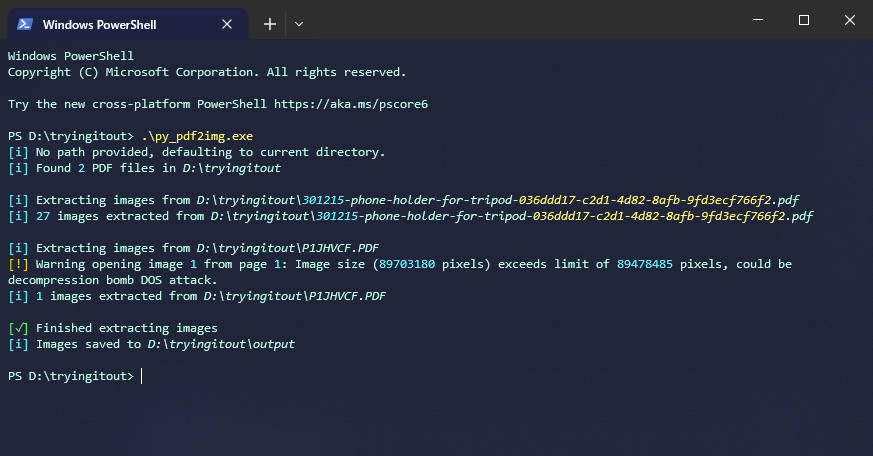

# PDF Image Extractor

This script extracts images from PDF files and saves them to a specified output directory.

## Installation

Using [virtual environment](https://docs.python.org/3/library/venv.html):
```
python -m venv venv
# In Windows PowerShell
venv\Scripts\Activate.ps1
# In Linux or Mac
source myvenv/bin/activate
```
Then install requirements.
```
pip install -r requirements.txt
```

## Usage
Extract images from a single PDF file
```
python py_pdf2img.py <file_path> [-o <output_dir>] [--allow-large-images]
```
Extract images from all PDF files in a directory
```
python py_pdf2img.py -d <dir_path> [-o <output_dir>] [--allow-large-images]
```

### Arguments
- `<file_path>`: Path to the PDF file.
- `d, --dir <dir_path>`: Directory containing PDF files.
- `o, --output-dir <output_dir>`: Output directory to save images. Defaults to current_directory/output.
- `--allow-large-images`: Removes the limit on the maximum image size that can be opened.

Example
Extract images from a single PDF file and save them to the default output directory:
```
python py_pdf2img.py example.pdf
```
Extract images from all PDF files in a directory and save them to a specified output directory:
```
python py_pdf2img.py -d pdf_directory -o images_output
```

## Making an executable
I use this script mostly on windows, and activating the venv every time is a hassle so I used pyinstaller to make an executable:

```
pip install -U pyinstaller
```
Then execute pyinstaller with the -F flag to make the exe a single file:

```
pyinstaller .\py_pdf2img.py -F
```

Finally one can run the resulting executable from the terminal

```
./py_pdf2img.exe example.pdf
```